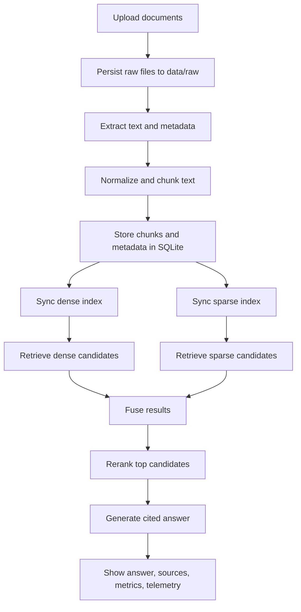

# Cloud RAG

Cloud RAG is a document question-answering system built around retrieval-augmented generation.

You upload PDFs, DOCX files, Markdown files, or plain text files, the app chunks and indexes them, and then answers questions using only retrieved evidence from those documents. The current default setup is intentionally cloud-first so indexing and retrieval work do not melt a laptop:

- local file parsing and chunking
- Pinecone for dense retrieval, sparse retrieval, and reranking
- Groq for answer generation
- Streamlit for the interactive UI

The repository still keeps a local fallback path for retrieval and answering, but the default configuration is optimized for an MVP that runs comfortably on lower-end hardware.

## What This Project Does

This project is designed for small knowledge-base style document Q&A.

Typical use cases:

- ask questions across uploaded policies, notes, or reports
- inspect the supporting passages behind an answer
- compare retrieval strategies with an evaluation script
- keep multiple document collections inside one app
- run a lightweight local workflow or a cloud-backed workflow from the same codebase

What it is not trying to be:

- a full multi-user SaaS app
- a permissions-heavy enterprise document platform
- an OCR-first ingestion pipeline for scanned archives

## Core Features

- PDF, DOCX, TXT, and Markdown ingestion
- stable chunking and metadata persistence in SQLite
- cloud retrieval with Pinecone integrated models
- optional local retrieval fallback with BM25 and FAISS
- reranking before final answer generation
- grounded answers with citations
- background indexing jobs in the Streamlit UI
- collections and query-time filtering
- retrieval result caching
- structured telemetry logs
- evaluation CLI for retrieval and answer checks

## Tech Stack

| Area | Technology |
| --- | --- |
| App framework | Python |
| UI | Streamlit |
| LLM orchestration | LangChain |
| Default answer model | Groq `llama-3.1-8b-instant` |
| Default dense retrieval | Pinecone integrated embeddings with `multilingual-e5-large` |
| Default sparse retrieval | Pinecone sparse index with `pinecone-sparse-english-v0` |
| Default reranker | Pinecone `bge-reranker-v2-m3` |
| Local dense fallback | FAISS + Ollama embeddings |
| Local sparse fallback | BM25 via `rank-bm25` |
| Local reranker fallback | `sentence-transformers` cross-encoder |
| Metadata store | SQLite |
| Document parsing | PyMuPDF, pypdf, python-docx |
| Evaluation | custom retrieval metrics + `ragas` dependency available |

## Default Runtime Modes

### Cloud-first default

This is the default path in the codebase:

- `RAG_RETRIEVAL_PROVIDER=pinecone`
- `RAG_RERANK_PROVIDER=pinecone`
- `RAG_LLM_PROVIDER=groq`
- `RAG_ANSWER_MODE=llm`

This mode keeps the laptop responsible only for:

- file upload persistence
- text extraction
- chunking
- UI rendering
- orchestration

### Local fallback

If you want to run more of the stack locally, the app also supports:

- local sparse retrieval
- local dense retrieval
- local reranking
- local LLM answering with Ollama

That path is useful for offline experiments, but it is slower and heavier on CPU/GPU, especially on laptops.

## How It Works

### High-level flow



### Indexing flow

When you index documents, the pipeline does this:

1. Saves the uploaded files under `data/raw/`
2. Computes a checksum for deduplication
3. Extracts text from PDF, DOCX, TXT, or MD files
4. Normalizes whitespace and basic formatting noise
5. Splits the content into chunks with overlap
6. Stores chunks and metadata in SQLite
7. Syncs the configured retrieval backend

Stored metadata includes fields like:

- `doc_id`
- `filename`
- `file_type`
- `page_number`
- `section_heading`
- `chunk_id`
- `collection_name`

### Query flow

When a user asks a question, the pipeline does this:

1. Applies any document or collection filters
2. Checks the retrieval cache
3. Runs dense retrieval, sparse retrieval, or both
4. Fuses the candidate lists for hybrid search
5. Reranks top candidates if reranking is enabled
6. Sends only the selected evidence to the answer model
7. Returns an answer with citations and source excerpts
8. Logs metrics and telemetry

### Answer grounding

The answer generator is configured to:

- answer only from supplied context
- cite factual claims with chunk labels like `[C1]`
- abstain when the retrieved evidence is insufficient

## Repository Layout

```text
rag/
  app/
    chains/         # main RAG orchestration
    generation/     # answer generation
    ingestion/      # document loading and chunking
    rerank/         # rerank backends
    retrieval/      # dense, sparse, hybrid, Pinecone adapters
    storage/        # SQLite metadata store
    ui/             # Streamlit app
    utils/          # models, runtime checks, background jobs, telemetry
  data/
    raw/            # uploaded source files
    processed/      # telemetry and processed artifacts
    eval/           # evaluation datasets
  indexes/          # local FAISS/BM25 assets if local retrieval is used
  scripts/
    build_index.py
    run_eval.py
    smoke_test.py
  tests/
  .env.example
  plan.md
  requirements.txt
```

## Local Development Setup

### Prerequisites

- Python 3.9+
- `pip`
- a Pinecone account and API key for the default retrieval path
- a Groq API key for the default answer generation path

Optional:

- Ollama, if you want local answering or local dense retrieval
- Tesseract OCR, `Pillow`, and `pytesseract` if you want OCR fallback for scanned PDFs

### 1. Create a virtual environment

```bash
python3 -m venv .venv
source .venv/bin/activate
```

### 2. Install dependencies

```bash
pip install -r requirements.txt
```

### 3. Configure environment variables

```bash
cp .env.example .env
```

At minimum for the default cloud path, set:

- `RAG_PINECONE_API_KEY`
- `RAG_GROQ_API_KEY`

### 4. Start the Streamlit app

```bash
streamlit run app/ui/streamlit_app.py
```

Then open the local Streamlit URL shown in the terminal.

## Running the Project Locally

### Using the UI

1. Start Streamlit
2. Upload one or more documents
3. Choose a collection name if you want to group files
4. Index the uploaded files
5. Ask questions in the chat panel
6. Inspect citations, retrieved chunks, and telemetry

### Using the CLI

Index one file or a directory:

```bash
python3 scripts/build_index.py path/to/docs
```

Sync retrieval indexes from the stored SQLite chunk corpus without rereading raw files:

```bash
python3 scripts/build_index.py --from-db
```

This is useful if:

- you changed the retrieval backend
- you need to resync Pinecone
- you want to rebuild from already stored chunks

## Configuration Guide

### Retrieval and answer providers

Key provider settings:

- `RAG_RETRIEVAL_PROVIDER`: `pinecone` or `local`
- `RAG_RERANK_PROVIDER`: `pinecone` or `local`
- `RAG_LLM_PROVIDER`: `groq` or `ollama`
- `RAG_ANSWER_MODE`: `llm` or `extractive`

### Retrieval tuning

- `RAG_ENABLE_DENSE_RETRIEVAL`
- `RAG_ENABLE_SPARSE_RETRIEVAL`
- `RAG_ENABLE_RERANKER`
- `RAG_DENSE_TOP_K`
- `RAG_SPARSE_TOP_K`
- `RAG_FUSED_TOP_K`
- `RAG_FINAL_CONTEXT_K`
- `RAG_CHUNK_SIZE`
- `RAG_CHUNK_OVERLAP`

### Pinecone settings

Important Pinecone settings:

- `RAG_PINECONE_API_KEY`
- `RAG_PINECONE_DENSE_INDEX`
- `RAG_PINECONE_SPARSE_INDEX`
- `RAG_PINECONE_DENSE_MODEL`
- `RAG_PINECONE_SPARSE_MODEL`
- `RAG_PINECONE_RERANK_MODEL`

Free-tier indexing controls:

- `RAG_PINECONE_UPSERT_BATCH_SIZE`
- `RAG_PINECONE_UPSERT_MAX_BATCH_TOKENS`
- `RAG_PINECONE_UPSERT_TOKENS_PER_MINUTE`
- `RAG_PINECONE_UPSERT_RETRY_ATTEMPTS`
- `RAG_PINECONE_UPSERT_RETRY_BASE_DELAY_SECONDS`

These exist because Pinecone Starter can rate-limit ingestion. The code batches and throttles uploads to make syncing more reliable on the free tier.

### Production-readiness features

- `RAG_RETRIEVAL_CACHE_SIZE`
- `RAG_ENABLE_STRUCTURED_LOGS`
- `RAG_TELEMETRY_LOG_PATH`
- `RAG_ENABLE_OCR`
- `RAG_OCR_LANGUAGE`
- `RAG_DEFAULT_COLLECTION_NAME`

## Local-only Mode

If you want a lighter local dev path without Pinecone or Groq, switch to a simpler local configuration:

```bash
RAG_RETRIEVAL_PROVIDER=local
RAG_RERANK_PROVIDER=local
RAG_ENABLE_DENSE_RETRIEVAL=false
RAG_ENABLE_RERANKER=false
RAG_ANSWER_MODE=extractive
```

This gives you:

- local sparse retrieval
- extractive answers built directly from retrieved passages
- no Pinecone dependency
- no Groq dependency

If you want local LLM answering too, enable Ollama and point `RAG_LLM_PROVIDER=ollama`.

## Evaluation

The repository includes an evaluation script to compare retrieval strategies and run answer-quality checks.

Run all retrieval baselines:

```bash
python3 scripts/run_eval.py --dataset data/eval/sample_questions.jsonl --mode all
```

Run hybrid + rerank and also check answer behavior:

```bash
python3 scripts/run_eval.py --dataset data/eval/sample_questions.jsonl --mode hybrid_rerank --with-generation
```

Supported retrieval modes:

- `dense`
- `sparse`
- `hybrid`
- `hybrid_rerank`
- `all`

Expected JSONL row shapes:

```json
{"question":"What is the refund policy?","gold_chunk_ids":["chunk-123","chunk-456"]}
```

```json
{"question":"What is the refund policy?","gold_filenames":["policy.md"],"answer_contains":["30 calendar days"]}
```

The evaluation script reports metrics such as:

- `HitRate@k`
- `Recall@k`
- `MRR@k`
- `nDCG@k`
- answer-contains pass rate
- refusal accuracy
- citation coverage

## Testing

Run the unit tests:

```bash
python3 -m unittest discover -s tests -p 'test_*.py'
```

Run the smoke test against the bundled sample corpus:

```bash
python3 scripts/smoke_test.py
```

Run smoke test with answer validation:

```bash
python3 scripts/smoke_test.py --with-generation
```

The smoke test forces a lightweight local retrieval mode so it can run offline for basic validation.

## Operational Notes

### Background indexing

The Streamlit UI supports background indexing jobs so large uploads do not block the entire session. Job status is shown in the sidebar.

### Collections and filters

Each indexed document belongs to a collection. You can:

- assign uploaded files to a collection at index time
- filter questions by collection
- filter questions by specific documents

### Telemetry

The app can write structured JSONL telemetry records containing indexing and answer events. This is useful for:

- debugging
- measuring latency
- inspecting abstention behavior
- tracing retrieval settings and filters

## Limitations

- scanned PDFs are not the main target yet; OCR is optional and not enabled by default
- Pinecone Starter can be slow for large ingest jobs because of rate limits
- cloud mode requires internet access and third-party APIs
- local heavy models can still be slow on laptop hardware
- there is no auth, multi-tenancy, or document permission model

## Security Notes

- do not commit `.env`
- rotate API keys if they were ever exposed
- assume uploaded document text is sent to third-party providers when cloud mode is enabled

## Why This Repo Is Useful

This project is a practical reference for building a grounded RAG system that is not just a toy chatbot:

- it keeps evidence visible
- it has real retrieval and reranking stages
- it supports evaluation
- it has a usable UI
- it includes a path from local experimentation to cloud-backed retrieval

## License

Add your preferred license here before publishing to GitHub.
