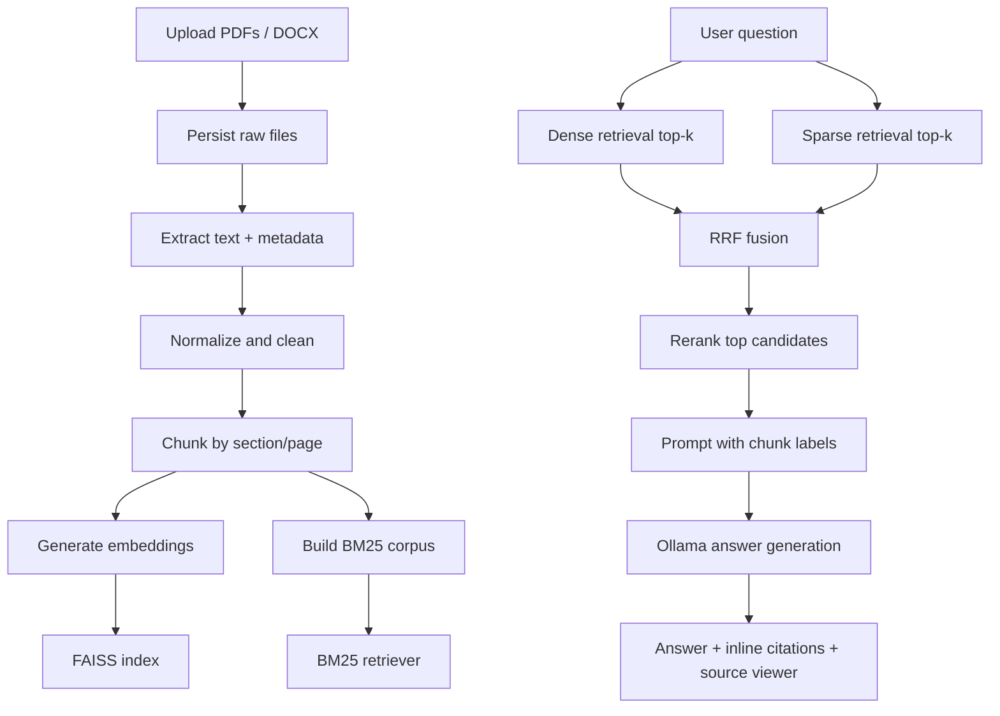

# RAG-Based Document Q&A System Plan

## 1. Goal

Build a local-first Retrieval-Augmented Generation (RAG) application that:

- Ingests PDF and document files.
- Chunks and indexes them for hybrid retrieval.
- Uses BM25 + dense vector search to find relevant context.
- Reranks retrieved chunks before answer generation.
- Generates grounded answers with source citations.
- Includes an evaluation loop so quality is measurable, not anecdotal.

This should look and feel like a small enterprise knowledge-base assistant, not a toy chatbot.

## 2. Recommended Stack

### Chosen default stack

- Orchestration: `LangChain`
- Local LLM serving: `Ollama`
- Answer model: `llama3.1:8b`
- Embeddings: `embeddinggemma` by default
- Optional multilingual embedding upgrade: `qwen3-embedding:0.6b`
- Vector store for MVP: `FAISS`
- Sparse retrieval: BM25 via `BM25Retriever`
- Fusion: weighted Reciprocal Rank Fusion (RRF)
- Reranker: `sentence-transformers` CrossEncoder with `BAAI/bge-reranker-base`
- UI: `Streamlit`
- Evaluation: `ragas` + classic retrieval metrics
- Metadata/state: `SQLite` + local filesystem

### Why this stack

- `LangChain` is the cleanest fit for a local-first build that needs Ollama, FAISS, BM25, and retriever fusion without introducing a heavier search backend on day one.
- `llama3.1:8b` is a better default than `llama3:8b` because the Ollama library exposes the newer family with a much longer context window.
- `FAISS` keeps the MVP fast, cheap, and portable.
- BM25 closes the gap on exact keywords, IDs, product names, and jargon that dense-only retrieval misses.
- A local reranker materially improves answer quality without sending data to a hosted provider.
- `Streamlit` is enough for a strong demo UI and quick iteration.

### Why not Haystack for v1

Haystack is still a valid alternative, especially if you later want a more explicit pipeline-first architecture or move toward OpenSearch/Qdrant-native hybrid retrievers. For this repo, I would start with LangChain because it is more direct for `FAISS + BM25 + Ollama + Streamlit`.

## 3. Product Scope

### In scope for v1

- Upload one or many PDFs / DOCX files.
- Persist uploaded files to disk.
- Extract, normalize, and chunk text.
- Build dense and sparse indexes.
- Run hybrid retrieval and reranking.
- Answer questions with inline citations.
- Show supporting chunks in the UI.
- Evaluate retrieval and answer quality on a curated test set.

### Out of scope for v1

- OCR for scanned PDFs
- User authentication / multi-tenancy
- Real-time collaborative workspaces
- Full cloud deployment automation
- Complex document permissions

These can be phase-2 extensions.

## 4. Architecture



## 5. Retrieval and Answering Design

### 5.1 Document ingestion

- Save uploaded files immediately to `data/raw/`.
- Extract text using:
  - `PyMuPDF` or `pypdf` for PDFs
  - `python-docx` for DOCX
- Normalize whitespace, repeated headers/footers where possible, and broken line wraps.
- Preserve source metadata:
  - `doc_id`
  - `filename`
  - `file_type`
  - `page_number` when available
  - `section_heading` when available
  - `chunk_id`

### 5.2 Chunking strategy

Start with:

- Chunk size: `600-900` tokens
- Overlap: `80-120` tokens
- Prefer splitting on headings and page boundaries before hard token cuts

Rules:

- Do not mix unrelated sections into the same chunk.
- Keep chunk IDs stable so evaluations and citations remain valid after reindexing.
- For PDFs, store page numbers for citation quality.
- For DOCX where page numbers are unreliable, cite section heading + chunk index.

### 5.3 Dense retrieval

- Embed all chunks with `embeddinggemma`.
- Store vectors in `FAISS`.
- Return `top_k_dense = 20` for candidate generation.

Upgrade path:

- Switch to `qwen3-embedding:0.6b` if multilingual quality becomes important.
- Abstract the vector layer so `Pinecone` can replace `FAISS` later without changing business logic.

### 5.4 Sparse retrieval

- Build a BM25 retriever over the same chunk corpus.
- Return `top_k_sparse = 20`.
- Use BM25 to catch exact matches, codes, names, version strings, and policy language.

### 5.5 Hybrid fusion

- Fuse dense and sparse results with weighted RRF.
- Start with equal weights, then tune after evaluation.
- Deduplicate on `chunk_id`, not raw text.

Initial tuning values:

- `dense_k = 20`
- `sparse_k = 20`
- `fused_k = 20`
- `rrf_k = 60`

### 5.6 Reranking

- Rerank the fused top 20 with a CrossEncoder.
- Default model: `BAAI/bge-reranker-base`
- Keep the top `5-8` chunks for final prompting.

Why reranking matters:

- Retrieval is recall-oriented.
- Reranking is precision-oriented.
- This two-stage setup is the standard pattern for stronger enterprise RAG.

### 5.7 Answer generation

- Use `llama3.1:8b` through Ollama.
- Prompt only on reranked chunks.
- Label chunks as `C1`, `C2`, `C3`, etc. in the prompt.
- Require every factual claim to cite one or more chunk labels.
- If the evidence is insufficient, the model must say it does not know from the uploaded documents.

Suggested output contract:

- `answer_markdown`
- `citations`
- `used_chunk_ids`

Prefer structured output first, then render to Markdown in the UI.

### 5.8 Citation and anti-hallucination rules

- Inline citations should map to chunk labels first, then to source metadata.
- UI should show:
  - filename
  - page number or section
  - chunk excerpt
- Reject or flag answers that contain claims without citations.
- If no retrieved chunk passes a minimum relevance threshold, abstain instead of guessing.

## 6. Evaluation Plan

### 6.1 Gold dataset

Create a small but real evaluation set from the project corpus:

- `50-100` questions
- Include easy, medium, and adversarial queries
- Include questions that should be answered with:
  - exact lookup
  - multi-chunk synthesis
  - refusal because evidence is missing

Each eval item should include:

- `question`
- `reference_answer`
- `reference_contexts` or gold chunk IDs
- `expected_refusal` flag when appropriate

### 6.2 Retrieval metrics

Track classic IR metrics:

- `Recall@k`
- `HitRate@k`
- `MRR@k`
- `nDCG@k`

These tell you whether the right chunk made it into the candidate set before generation.

### 6.3 Generation metrics

Track `ragas` metrics plus one manual review slice:

- `Faithfulness`
- `Answer Relevancy`
- `Context Precision`
- `Context Recall`
- `Factual Correctness`
- `Semantic Similarity`

Do not rely on one LLM-judge metric alone. Use them for trend detection, then manually inspect failures.

### 6.4 Operational metrics

Track:

- indexing time per document
- query latency
- reranker latency
- tokens sent to generator
- citation coverage
- abstention rate
- error rate

### 6.5 Baseline quality targets

Use these as initial tuning goals, not promises:

- `Recall@10 >= 0.85`
- `MRR@10 >= 0.70`
- `Faithfulness >= 0.85`
- `Citation coverage = 100%` for factual statements in final answers
- Query response feels acceptable on local hardware for a small corpus

## 7. Suggested Repository Layout

```text
rag/
  app/
    chains/
    ingestion/
    retrieval/
    rerank/
    generation/
    storage/
    ui/
    utils/
  data/
    raw/
    processed/
    eval/
  indexes/
    faiss/
    bm25/
  scripts/
  tests/
  plan.md
  README.md
  requirements.txt
  .env.example
```

Suggested module split:

- `app/ingestion/loaders.py`
- `app/ingestion/chunking.py`
- `app/storage/metadata_store.py`
- `app/retrieval/dense.py`
- `app/retrieval/sparse.py`
- `app/retrieval/hybrid.py`
- `app/rerank/cross_encoder.py`
- `app/generation/answer_chain.py`
- `app/ui/streamlit_app.py`
- `scripts/build_index.py`
- `scripts/run_eval.py`

## 8. Implementation Roadmap

### Phase 0: Bootstrap

- Create Python project scaffold.
- Add dependency management and `.env.example`.
- Define config model for:
  - Ollama host
  - answer model
  - embedding model
  - vector backend
  - retrieval top-k values

Exit criteria:

- Project runs locally.
- Ollama connectivity check passes.

### Phase 1: Ingestion and indexing

- Implement upload persistence.
- Build PDF/DOCX loaders.
- Normalize text and chunk documents.
- Store metadata in SQLite / JSONL.
- Build FAISS index and BM25 corpus.

Exit criteria:

- Uploading a document creates stable chunks and both indexes.

### Phase 2: Hybrid retrieval

- Implement dense retriever.
- Implement BM25 retriever.
- Add RRF fusion and chunk dedupe.
- Add retrieval debugging output for inspection.

Exit criteria:

- A query returns fused candidates with scores and metadata.

### Phase 3: Reranking and answering

- Add CrossEncoder reranker.
- Feed top reranked chunks to the generator.
- Enforce cited answers and abstention behavior.
- Add prompt templates and structured output parsing.

Exit criteria:

- Answers are grounded and include citations.

### Phase 4: Streamlit UI

- Multi-file upload
- Index status / progress
- Chat interface
- Source panel with cited excerpts
- Settings panel for model and retrieval controls

Exit criteria:

- User can upload docs, ask questions, and inspect evidence in one session.

### Phase 5: Evaluation and tuning

- Build eval dataset.
- Add `run_eval.py`.
- Compare:
  - dense only
  - sparse only
  - hybrid
  - hybrid + reranker
- Tune chunk size, overlap, top-k, and prompt wording.

Exit criteria:

- Hybrid + reranker outperforms simpler baselines on the eval set.

### Phase 6: Production-readiness extensions

- Add backend abstraction for `Pinecone`.
- Add caching of embeddings and retrieval results.
- Add background indexing jobs.
- Add OCR pipeline for scanned PDFs.
- Add observability and structured logs.
- Add doc-level filters and collections.

Exit criteria:

- The system is ready to move beyond a portfolio demo.

## 9. Pinecone Upgrade Path

For the MVP, stay on FAISS.

When corpus size or deployment requirements grow:

- Introduce a vector store interface:
  - `FaissStore`
  - `PineconeStore`
- Keep chunk metadata storage separate from vector storage.
- Move the dense index to Pinecone first.
- If you want managed hybrid search in Pinecone, prefer the single hybrid index path first because it is simpler operationally.
- Keep reranking as a separate stage so it can remain local or be swapped later.

## 10. Risks and Mitigations

### Scanned or messy PDFs

Risk:

- Text extraction quality can collapse retrieval quality.

Mitigation:

- Start with digitally generated PDFs only.
- Add OCR in a later production-hardening phase.

### Hallucinated answers with fake citations

Risk:

- The model may produce confident but weakly grounded synthesis.

Mitigation:

- Prompt with strict chunk labels.
- Enforce citation presence.
- Refuse when evidence is weak.
- Keep source viewer visible.

### Local model latency

Risk:

- Reranking and generation may be slow on CPU-only setups.

Mitigation:

- Keep rerank set small.
- Allow smaller models via config.
- Cache embeddings and indexes.

### Sparse index drift

Risk:

- Dense and sparse indexes can get out of sync after document updates.

Mitigation:

- Rebuild both indexes from the same canonical chunk store.
- Version index snapshots.

## 11. Immediate Build Order

1. Scaffold project and config.
2. Implement ingestion and chunk persistence.
3. Build FAISS + BM25 indexes.
4. Implement hybrid retrieval with RRF.
5. Add reranker.
6. Add answer chain with citations and abstention.
7. Build Streamlit UI.
8. Create eval set and tune.

## 12. Research Notes

The main choices above are based on current official docs and model pages:

- LangChain currently exposes direct `ChatOllama` and `OllamaEmbeddings` integrations, along with FAISS and retriever fusion primitives.
- Ollama currently recommends embedding models such as `embeddinggemma`, `qwen3-embedding`, and `all-minilm` for retrieval use cases.
- The Ollama library page for `llama3.1` is a better fit than the older `llama3` page because of the longer context window for answering over retrieved chunks.
- Pinecone currently recommends hybrid retrieval for combining semantic and lexical search, and reranking as a second-stage precision step.
- Streamlit's uploader keeps files in memory unless the app saves them, so the ingestion flow should persist uploads immediately.
- Ragas supports the core metrics needed to evaluate a RAG application beyond simple manual spot checks.

## 13. Source Links

- LangChain Ollama provider docs: <https://docs.langchain.com/oss/python/integrations/providers/ollama/>
- LangChain ChatOllama docs: <https://docs.langchain.com/oss/python/integrations/chat/ollama>
- LangChain OllamaEmbeddings docs: <https://docs.langchain.com/oss/python/integrations/text_embedding/ollama>
- LangChain FAISS docs: <https://api.python.langchain.com/en/latest/community/vectorstores/langchain_community.vectorstores.faiss.FAISS.html>
- LangChain EnsembleRetriever docs: <https://api.python.langchain.com/en/latest/langchain/retrievers/langchain.retrievers.ensemble.EnsembleRetriever.html>
- LangChain BM25Retriever source docs: <https://api.python.langchain.com/en/latest/_modules/langchain_community/retrievers/bm25.html>
- Haystack InMemoryBM25Retriever docs: <https://docs.haystack.deepset.ai/v2.0/docs/inmemorybm25retriever>
- Haystack hybrid retriever example: <https://docs.haystack.deepset.ai/docs/supercomponents>
- Ollama embeddings docs: <https://docs.ollama.com/capabilities/embeddings>
- Ollama chat API docs: <https://docs.ollama.com/api/chat>
- Ollama `llama3.1` model page: <https://ollama.com/library/llama3.1>
- Ollama `embeddinggemma` model page: <https://ollama.com/library/embeddinggemma>
- Ollama `qwen3-embedding` model page: <https://ollama.com/library/qwen3-embedding>
- Pinecone hybrid search docs: <https://docs.pinecone.io/guides/search/hybrid-search>
- Pinecone reranker model example: <https://docs.pinecone.io/models/bge-reranker-v2-m3>
- Streamlit chat elements docs: <https://docs.streamlit.io/library/api-reference/chat>
- Streamlit uploader docs: <https://docs.streamlit.io/develop/api-reference/widgets/st.file_uploader>
- Streamlit uploader storage behavior: <https://docs.streamlit.io/knowledge-base/using-streamlit/where-file-uploader-store-when-deleted>
- Sentence Transformers CrossEncoder docs: <https://www.sbert.net/docs/package_reference/cross_encoder/cross_encoder.html>
- Ragas evaluation docs: <https://docs.ragas.io/en/v0.2.1/getstarted/rag_evaluation/>
- Ragas context precision docs: <https://docs.ragas.io/en/v0.3.0/concepts/metrics/available_metrics/context_precision/>
- Ragas intro docs: <https://docs.ragas.io/>
